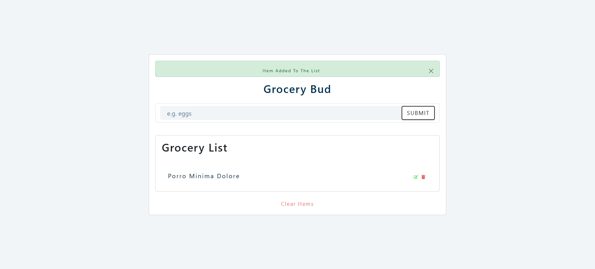
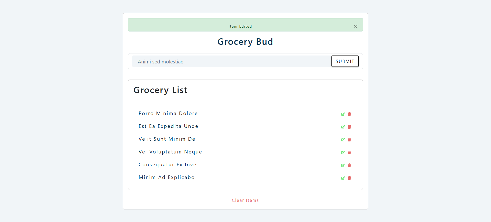
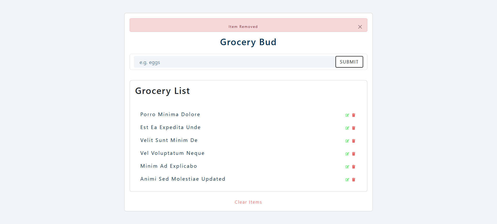
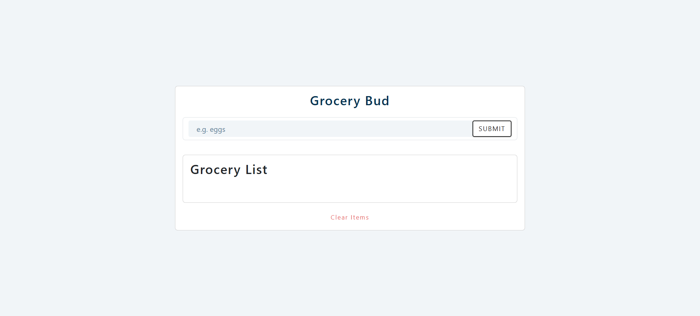
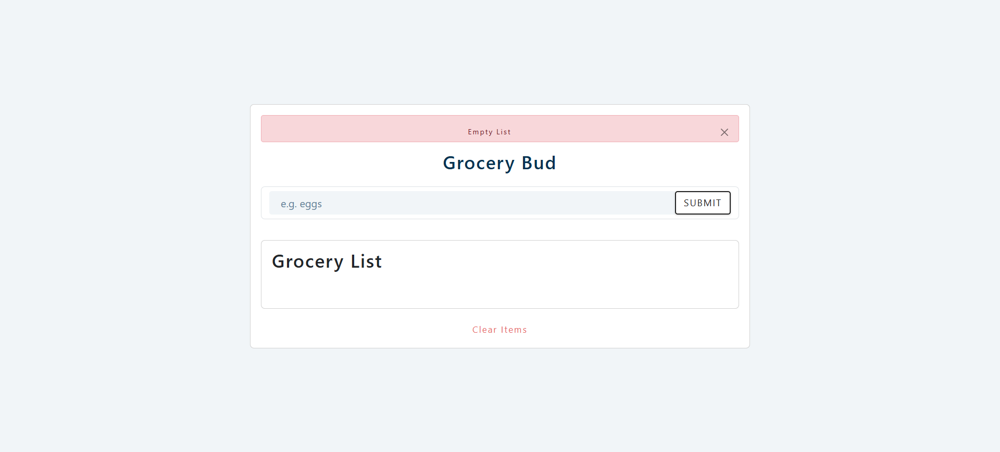

# Grocery Bud

A React application to manage your grocery list. Add, edit, and remove items with local storage persistence to keep your list saved even after refreshing the page.

## Features

- **Add Items**: Easily add new items to your grocery list.
- **Edit Items**: modify existing items in the list.
- **Remove Items**: Delete individual items or clear the entire list.
- **Alerts**: Visual feedback for every action (add, edit, remove, empty input).
- **Local Storage**: Data persists in the browser's local storage.

## Setup Instructions

In the project directory, you can run:

### `npm install`

Installs the necessary dependencies, including `react-bootstrap` and `bootstrap`.

### `npm start`

Runs the app in the development mode.\
Open [http://localhost:3000](http://localhost:3000) to view it in your browser.

The page will reload when you make changes.\
You may also see any lint errors in the console.

## Technologies Used

- React
- React Bootstrap
- React Icons
- Local Storage API
