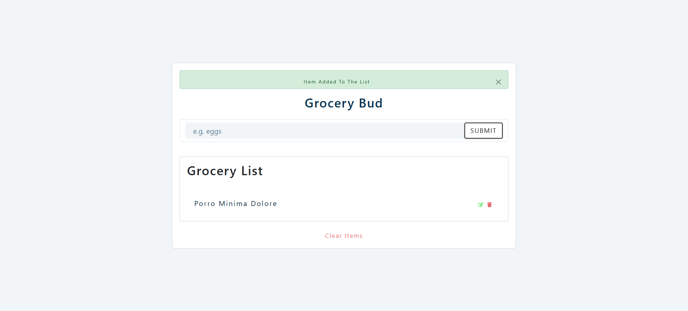
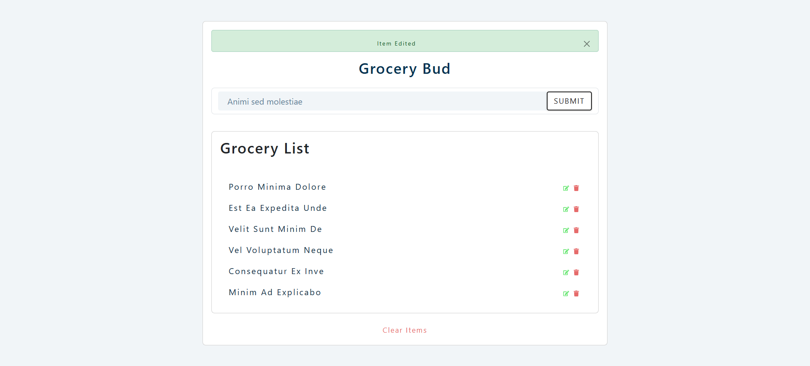
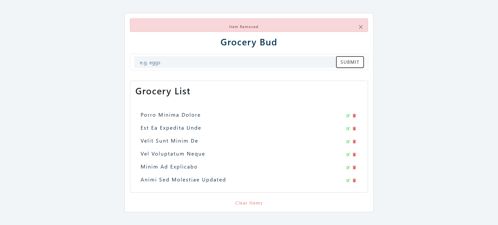
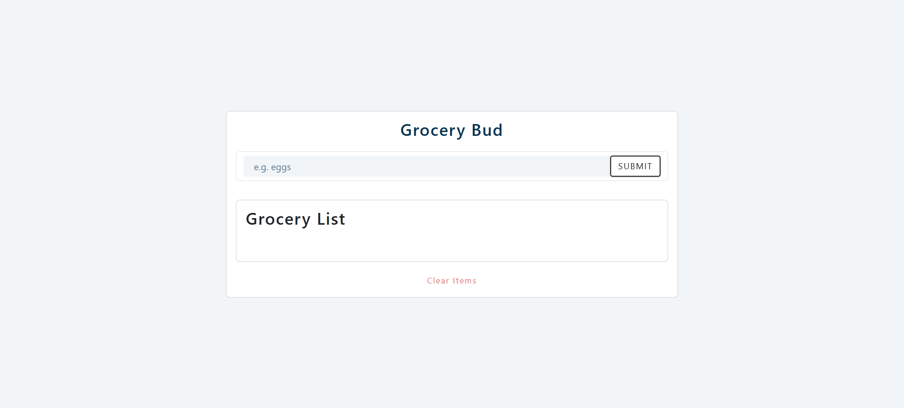
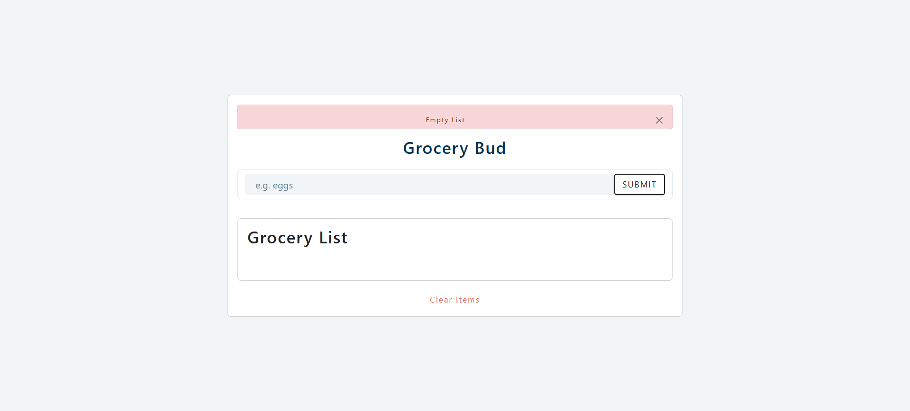

# 🛒 Grocery Bud

A sleek and responsive React application designed to help you manage your grocery list efficiently. With built-in local storage persistence, your items remain saved even after a page refresh.

---

## 📸 Screens

| State | Preview |
| :--- | :--- |
| **Item Added** |  |
| **Edit Item** |  |
| **Remove Item** |  |
| **Empty Input** |  |
| **Empty List** |  |

---

## ✨ Features

- **Add Items**: Quickly append new items to your grocery list.
- **Edit Items**: Update existing items with a single click.
- **Remove Items**: Delete specific items or clear the entire list at once.
- **Visual Alerts**: Real-time feedback via toast-style alerts for every action (add, edit, remove, or empty input).
- **Persistence**: Leverages the **Local Storage API** to ensure your data survives browser restarts.
- **Responsive Design**: Built with React Bootstrap for a seamless experience across devices.

---

## 🚀 Getting Started

Follow these steps to get the project up and running on your local machine.

### Prerequisites

- Node.js (v14 or higher recommended)
- npm or yarn

### Installation

1. **Clone the repository:**
   ```bash
   git clone https://github.com/your-username/grocery-bud.git
   ```

2. **Navigate to the project directory:**
   ```bash
   cd grocery-bud
   ```

3. **Install dependencies:**
   ```bash
   npm install
   ```

### Available Scripts

In the project directory, you can run:

#### `npm start`
Runs the app in development mode.  
Open [http://localhost:3000](http://localhost:3000) to view it in your browser.  
The page will reload automatically when you make edits.

#### `npm run build`
Builds the app for production to the `build` folder.  
It correctly bundles React in production mode and optimizes the build for the best performance.

---

## 🛠️ Technologies Used

- **Frontend**: [React.js](https://reactjs.org/)
- **Styling**: [Bootstrap](https://getbootstrap.com/) & [React Bootstrap](https://react-bootstrap.github.io/)
- **Icons**: [React Icons](https://react-icons.github.io/react-icons/)
- **Storage**: Browser Local Storage API

---

## 🤝 Community & Contributions

Contributions are what make the open-source community such an amazing place to learn, inspire, and create. Any contributions you make are **greatly appreciated**.

- **Code of Conduct**: Please read our [Code of Conduct](CODE_OF_CONDUCT.md) to understand the standards of behavior we expect in our community.
- **Contributing**: Check out the [Contributing Guidelines](CONTRIBUTING.md) for details on our code of conduct and the process for submitting pull requests.
- **Security**: Please refer to our [Security Policy](SECURITY.md).
- **Issue Templates**: When opening an issue, please use the provided [Bug Report](.github/ISSUE_TEMPLATE/bug_report.md) or [Feature Request](.github/ISSUE_TEMPLATE/feature_request.md) templates.

---

## 📜 License

Distributed under the MIT License. See `LICENSE` for more information.
